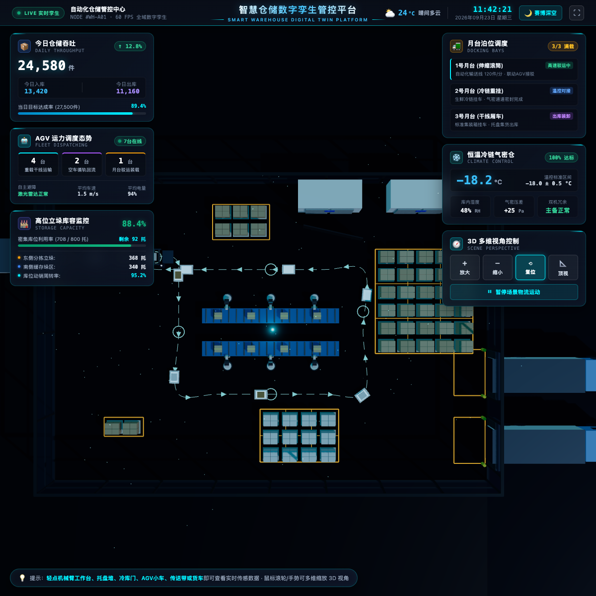
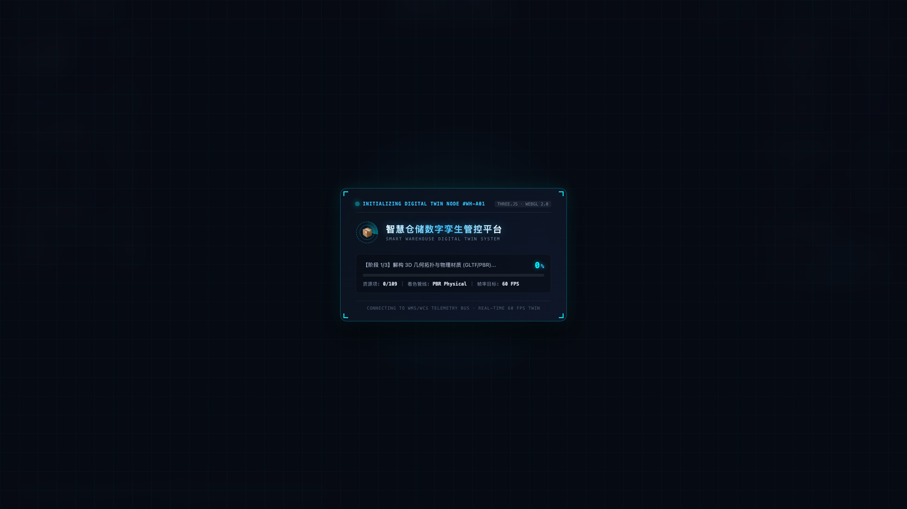

# 智慧仓储数字孪生平台 (smart-warehouse)
> **Smart Warehouse Digital Twin Platform**

[](https://smart-warehouse-wine.vercel.app)
[](https://vuejs.org/)
[](https://vitejs.dev/)
[](https://threejs.org/)
[](https://www.typescriptlang.org/)
[](https://github.com/Xxcool)
[](LICENSE)

🔗 **公网在线体验地址 (Live Demo)**：[https://smart-warehouse-wine.vercel.app](https://smart-warehouse-wine.vercel.app)

<div align="center">
  
</div>

一个基于 **Vue 3 + Vite + TypeScript + Three.js** 与 **Blender 5.2.2 LTS 高精建模** 的现代化工业级 3D 智慧物流与冷链数字孪生管控大屏系统。支持全域赛博深空与白昼展厅双风格无损切换、工业级 5S 地面标线与 AGV 闭环物料搬运仿真。

---

## 📸 全景效果图集 (Showcase Gallery)

| 🌙 赛博深空沉浸全息 (Cyber Immersion) | ☀️ 白昼展厅沙盘模式 (Studio Day) |
| :---: | :---: |
|  |  |

| 🗺️ 顶视工程级标线与 AGV 激光轨迹 | 🛰️ 3D 实体微晶吸附感知卡片 |
| :---: | :---: |
|  |  |

<div align="center">
  
  <p><em>全息数字孪生初始化控制舱 (Digital Twin Initialization HUD)</em></p>
</div>

---

## 🌟 核心特性 (Key Features)

- **现代化前端与工业大屏架构**：
  - 基于 **Vue 3 + Vite 5 + TypeScript** 全栈工程化，零运行时包袱，极速 HMR 热更新；
  - 3D 渲染核心引擎与全息大屏 UI 组件解耦，左翼态势、右翼设备管控、顶部指挥条与三维画布模块化高内聚；
  - 静态资源经 Vite 自动化按需分包优化（Three.js 核心分包独立）与强缓存配置。
- **全域双视觉风格无损切换 (Dual-Theme Engine)**：
  - **🌙 赛博深空全息模式**：深晶黑环体厂房、高折射微晶玻璃、荧光青蓝激光导航光带与暗黑磨砂玻璃 HUD，带来强烈沉浸感；
  - **☀️ 白昼展厅沙盘模式**：通透素雅浅灰展台地坪、物理骨架明暗高反差，最大化突显设备机械结构；
  - 支持顶部导航栏随时一键无损平滑切换，PBR 材质反射率与天光色温实时自适应联动。
- **全息工业级 HUD 态势监控体系**：
  - **顶部指挥栏 (HeaderBar)**：52px 极简全息条，集成毫秒级跳动数字时钟、多维气象环境监测（温度、相对湿度、AQI 空气质量、风向）、全屏切换与双模式主题切换；
  - **左翼态势 HUD (LeftTelemetryHud)**：今日仓储吞吐量进出库实时看板、7 台 AGV 运力调度多维状态、高位立体库容率；
  - **右翼设备负荷与控制 HUD (RightEquipmentHud)**：三大月台泊位调度状态、恒温冷链气密仓遥测、3D 多维视角交互控制坞（放大/缩小/复位/顶视图/暂停物流动画）；
  - **底部指引胶囊 (TipBar)**：深色微晶磨砂材质，清晰引导用户探索 3D 空间交互。
- **AGV 真实装卸闭环物流体系**：
  - **动态装卸闭环**：实现“伸缩辊道接驳装载 ➔ 货物颜色属性动态同步 ➔ 重载激光导引运送 ➔ 自动卸载至指定托盘/货架 ➔ 空车回流”的闭环作业流；
  - **货物属性一致性**：伸缩辊道上的多彩箱件装车时色彩实时映射至 AGV 载荷，彻底解决“变色/错乱”问题；
  - **智能避障与对齐**：7 台 AGV 均具备实时切线航向自动对齐、动态差速过弯与空间避碰。
- **工业级 5S 货区标线与平滑激光轨迹**：
  - **工业 5S 货物存储区**：采用安全警示琥珀黄（`#f59e0b`）精确标注东侧托盘区、南侧高位库、月台缓冲区与入库接驳箱框，彻底消除历史遗留杂乱斜线；
  - **1.2m 平滑倒角激光引导线**：双层超导底带 + 青蓝荧光中心发光线 + 运行方向动态箭头 + 站点环形停靠光圈，符合现代智能自动化工厂规范。
- **全息数字孪生初始化控制舱 (Loading HUD)**：
  - 双环逆向旋转全息雷达激光扫描；
  - 几何拓扑解构、闭环状态机装配、全息 HUD 挂载三阶段动态实时遥测；
  - 极速完成握手后毫秒级平滑淡出，初始入场 100% 纯净无遮挡，按需呼出设备卡片。
- **专业级交互与空间吸附微晶弹窗 (AnchoredPopup)**：
  - **3D-to-2D 空间态势投影**：轻点场景内 AGV、机械臂、托盘垛、冷库门或货车即刻吸附呼出微晶传感卡片；
  - **视口自适应弹性防越界**：具备上下智能翻转与左右边缘弹性钳夹算法，确保在任何分辨率与视口下绝不溢出屏幕；
  - **纯 WebGL 相机 Dolly 缩放**：拦截浏览器默认 Page Zoom，缩放独占作用于 3D 摄像机视轴，大屏 UI 保持固定视网膜级清晰度。

---

## 🛠️ 技术栈 (Tech Stack)

* **应用框架**：Vue 3 (`Composition API`, `<script setup>`)
* **构建工具**：Vite 5
* **编程语言**：TypeScript 5
* **三维渲染引擎**：Three.js (`WebGLRenderer`, `PerspectiveCamera`, `OrbitControls`)
* **模型资产构建**：Blender 5.2.2 LTS (PBR 材质、GLTF 2.0 规范，全场景优化至 1.8 MB)
* **部署平台**：Vercel (原生 Vite 支持 + 静态资源强缓存路由优化)

---

## 📁 目录结构 (Directory Structure)

```text
smart-warehouse/
├── docs/                          # 场景设计、架构规范与高清效果图集
│   ├── ARCHITECTURE.md            # Three.js 场景管理器与性能优化架构规范
│   └── images/                    # 全屏态势效果图与运行演示图
├── public/
│   ├── smart_warehouse.glb        # Blender 高精三维孪生模型 (~1.8 MB)
│   └── models/
├── src/
│   ├── components/
│   │   ├── HeaderBar.vue          # 数字化指挥中心 52px 顶栏与实时气象时钟
│   │   ├── LeftTelemetryHud.vue   # 左侧：全息运营态势监控 HUD (吞吐/调度/库容)
│   │   ├── RightEquipmentHud.vue  # 右侧：设施负荷监控 + 3D 视角多维控制坞 HUD
│   │   ├── AnchoredPopup.vue      # 3D 实体吸附与自适应防越界微晶弹窗
│   │   ├── LoadingOverlay.vue     # 全息数字孪生初始化控制舱与三阶段遥测
│   │   └── TipBar.vue             # 底部操作提示栏
│   ├── core/
│   │   ├── WarehouseScene.ts      # Three.js 核心场景引擎、双主题渲染、动画驱动与事件调度
│   │   └── constants.ts           # 场景业务数据字典与指标配置
│   ├── types/
│   │   └── warehouse.ts           # TypeScript 领域类型声明
│   ├── App.vue                    # 应用根组件 (HUD 组合与视口监听)
│   ├── main.ts                    # 应用入口
│   └── vite-env.d.ts
├── index.html                     # 根 HTML 模板
├── package.json                   # 依赖与脚本
├── tsconfig.json                  # TypeScript 编译配置
├── vite.config.ts                 # Vite 构建配置
├── vercel.json                    # Vercel 部署路由与 GLB 缓存配置
└── README.md                      # 项目说明文档
```

---

## 🚀 本地快速启动 (Local Development)

```bash
# 1. 克隆并进入项目目录
git clone https://github.com/Xxcool/smart-warehouse.git
cd smart-warehouse

# 2. 安装依赖
npm install # 或 pnpm install

# 3. 启动开发服务器 (默认端口 8088)
npm run dev

# 4. 构建生产产物
npm run build

# 5. 本地预览生产构建
npm run preview
```

---

## ☁️ Vercel 一键部署 (Vercel Deployment)

本项目已配置标准 `vercel.json`，构建命令自动指向 `npm run build`，输出目录为 `dist`：
1. 推送代码至 GitHub 仓库；
2. 登录 [Vercel](https://vercel.com/)，点击 **「Add New...」 -> 「Project」**；
3. 选择导入 GitHub 仓库 **`smart-warehouse`**；
4. Vercel 将自动识别 Vite 框架，点击 **「Deploy」** 即可一键完成全自动化构建部署！

---

## ⌨️ 键盘快捷键 (Shortcuts)

| 按键 | 功能说明 |
| :--- | :--- |
| `+` / `=` | 拉近相机视角 (Zoom In) |
| `-` | 拉远相机视角 (Zoom Out) |
| `0` / `R` | 复位为标准等轴测默认视角 (Reset View) |
| `T` | 切换为垂直平面俯瞰视角 (Top View) |
| `Space` (空格) | 暂停 / 恢复场景内所有物流运动动画 |

---

## 👨‍💻 作者 (Author)

* **Xxcool** - [GitHub (@Xxcool)](https://github.com/Xxcool) · [掘金技术主页](https://juejin.cn/user/4265760845468296/posts)

---

## 📄 开源许可证 (License)

本项目遵循 [MIT License](LICENSE) 开源协议。
