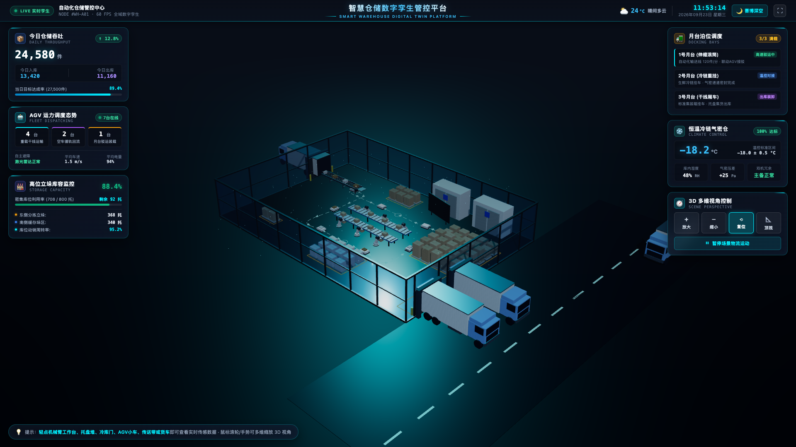
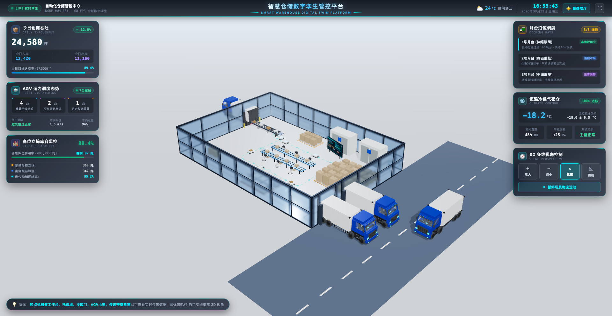
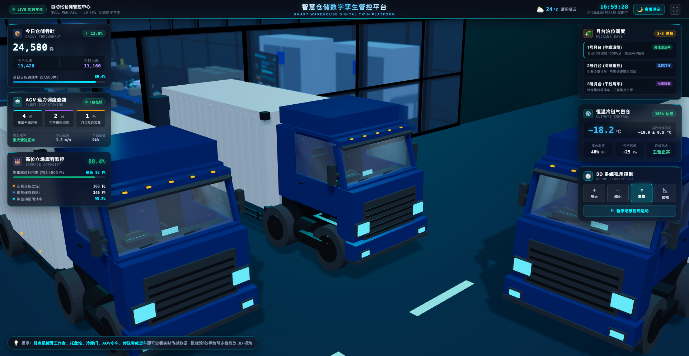
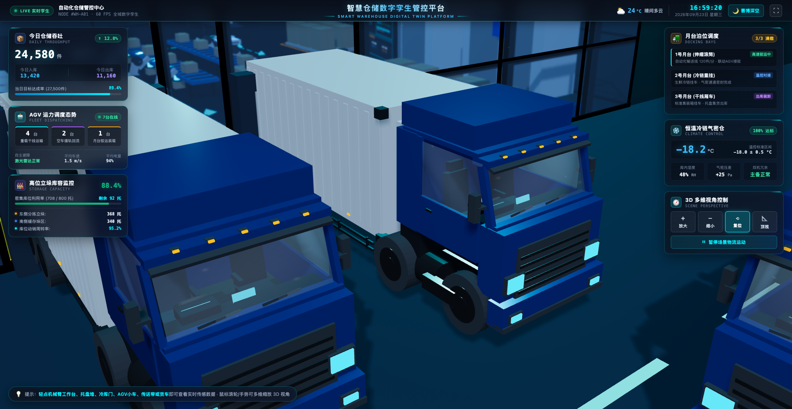
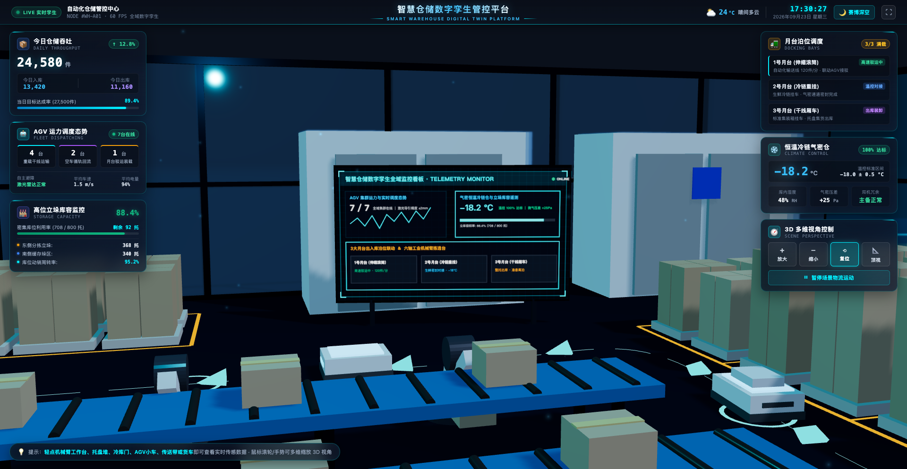
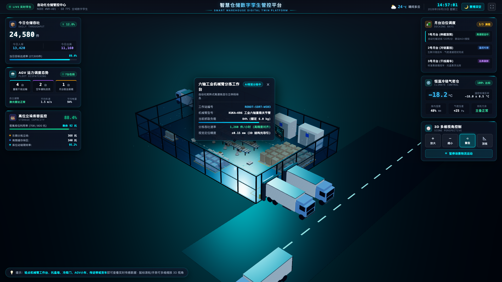
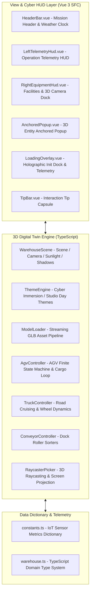

# Smart Warehouse 3D Digital Twin Platform (smart-warehouse)

<p align="left">
  <a href="./README.md">简体中文</a> | <b>English</b>
</p>

[](https://smart-warehouse-wine.vercel.app)
[](https://vuejs.org/)
[](https://vitejs.dev/)
[](https://threejs.org/)
[](https://www.typescriptlang.org/)
[](https://github.com/Xxcool)
[](LICENSE)

🔗 **Live Demo**: [https://smart-warehouse-wine.vercel.app](https://smart-warehouse-wine.vercel.app)

<div align="center">
  
</div>

An industrial-grade 3D smart warehouse and logistics digital twin management platform built with **Vue 3 + Vite + TypeScript + Three.js**. It intuitively reproduces the real-time operations of a modern intelligent logistics park—featuring autonomous AGV closed-loop material handling, automated stereoscopic storage and retrieval (ASRS), cold-chain airtight chamber temperature monitoring, and loading dock truck logistics. Supports seamless zero-latency switching between futuristic Cyber Night and Studio Day visual themes.

---

## 📑 Table of Contents

- [📸 Showcase](#showcase)
- [🌟 Key Features](#key-features)
- [🛠️ Tech Stack](#tech-stack)
- [🏗️ System Architecture](#system-architecture)
- [📁 Project Structure](#project-structure)
- [🚀 Quick Start](#quick-start)
- [⌨️ Keyboard Shortcuts](#keyboard-shortcuts)
- [👨‍💻 Author](#author)
- [📄 License](#license)

---

## 📸 Showcase

| 🌙 Cyber Night Mode | ☀️ Studio Day Mode |
| :---: | :---: |
|  |  |

| 🚚 Heavy Truck Transparent Windows & Interior | 🚛 Clearcoat Paint & Anti-Flicker Headlights |
| :---: | :---: |
|  |  |

| 📺 In-Warehouse Emissive Holographic Telemetry Screen | 🛰️ Interactive Device Inspector & HUD Cards |
| :---: | :---: |
|  |  |

---

## 🌟 Key Features

- **🌓 Dual Visual Theme Switching**:
  - **Cyber Deep Space Mode**: Translucent crystalline dark-blue floor paired with cyan-blue laser guide tracks and neon accents, delivering a high-tech futuristic industrial aesthetic.
  - **Studio Day Mode**: Crisp, minimalist light-gray exhibition showroom style, highlighting mechanical silhouettes and spatial warehouse structures.
  - One-click seamless theme toggling via the top navigation bar, with automatic transitions for lighting color temperature and ground PBR materials.

- **🤖 Autonomous AGV Closed-Loop Material Handling**:
  - Multiple AGV robots navigate along floor magnetic/laser guidance tracks in a complete operational cycle: dispatch, cargo pickup, heavy-load transport, automated rack unloading, and empty return.
  - Dynamic pallet box persistence maintaining consistent colors and attributes throughout transit, equipped with adaptive cornering and collision avoidance.

- **🚚 Heavy Industrial Truck & Cabin Details**:
  - Physically accurate transparent glass shaders for the windshield and side windows, revealing the detailed cabin interior including the steering wheel, center console LCD display, and seats.
  - Headlights, fog lights, and roof clearance lamps are anti-flicker optimized (using non-coplanar offsets and polygon offsets) to remain stable, crisp, and glare-free at all viewing distances and motion states.
  - External roadway rendered in realistic deep-gray industrial asphalt, creating a clear visual hierarchy with the warehouse floor.

- **📊 In-Warehouse Holographic Telemetry Screen**:
  - A prominent self-luminous holographic display positioned inside the facility, rendering real-time AGV telemetry waveforms, cold-chain storage metrics (-18.2°C), loading dock bay statuses, and warehouse throughput.

- **🖥️ Mission Control HUD & Telemetry Panels**:
  - **Top Bar**: Integrated real-time clock, weather and humidity monitors, and fullscreen toggle.
  - **Left Telemetry Dock**: Live overview of daily throughput, AGV fleet scheduling, and high-bay racking utilization.
  - **Right Control Dock**: Real-time status monitoring of 3 dock loading bays and cold-chain chambers, plus a 3D camera control dock (Zoom In, Zoom Out, Reset, Top View, Play/Pause animation).

- **🔍 Interactive Raycasting & Smooth Cinematic Camera Transitions**:
  - Click any equipment in the scene (trucks, AGVs, conveyors, robotic arms, pallet stacks) to smoothly push the camera towards the target.
  - Contextual HUD popup anchored to the selected asset displaying real-time operational parameters; click anywhere in empty space to smoothly exit and resume free navigation.

---

## 🛠️ Tech Stack

* **Frontend Framework**: Vue 3 (`Composition API`, `<script setup>`)
* **Build Tool**: Vite 5
* **Programming Language**: TypeScript 5 (Strict Mode)
* **3D Engine**: Three.js (`WebGLRenderer`, `PerspectiveCamera`, `OrbitControls`)
* **3D Modeling & Pipeline**: Blender 5.2.2 LTS (PBR Materials, GLTF 2.0 Binary Export)

---

## 🏗️ System Architecture

The platform separates rendering concerns into a modular multi-tier architecture:



For more architectural details, please refer to the [Architecture Specification](docs/ARCHITECTURE.md).

---

## 📁 Project Structure

```text
smart-warehouse/
├── docs/                          # Architectural documentation & HD showcase gallery
├── public/
│   ├── smart_warehouse.glb        # High-precision 3D warehouse digital twin model
│   └── models/
├── src/
│   ├── components/                # HUD overlay components & popup dialogs
│   ├── core/
│   │   ├── WarehouseScene.ts      # Three.js core scene manager & render loop
│   │   └── constants.ts           # IoT metrics & equipment data dictionary
│   ├── types/                     # TypeScript type definitions
│   ├── App.vue                    # Main container & 3D canvas viewport
│   └── main.ts                    # Application entry point
├── index.html                     # HTML template
├── package.json                   # Dependencies and scripts
├── README.md                      # Chinese Documentation (中文文档)
└── README_EN.md                   # English Documentation (英文文档)
```

---

## 🚀 Quick Start

### Prerequisites
- Node.js (>= 18.0.0)
- npm or pnpm

### Installation & Run

```bash
# 1. Clone the repository
git clone https://github.com/Xxcool/smart-warehouse.git
cd smart-warehouse

# 2. Install dependencies
npm install # or pnpm install

# 3. Start local development server (default port: 8088)
npm run dev

# 4. Build for production
npm run build

# 5. Preview production build locally
npm run preview
```

Open your browser at `http://localhost:8088` to explore the digital twin platform.

---

## ⌨️ Keyboard Shortcuts

| Shortcut | Description |
| :--- | :--- |
| `+` / `=` | Zoom In |
| `-` | Zoom Out |
| `0` / `R` | Reset to Default Isometric View |
| `T` | Switch to Top-Down Orthographic View |
| `Space` | Pause / Resume Scene Simulation Animations |

---

## 👨‍💻 Author

* **Xxcool** - [GitHub (@Xxcool)](https://github.com/Xxcool) · [Juejin Profile](https://juejin.cn/user/4265760845468296/posts)

---

## 📄 License

This project is licensed under the [MIT License](LICENSE).
