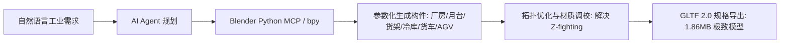

# 一人即团队！基于 AI Agent + Blender + Vue 3 + Three.js 的工业级 3D 智慧仓储数字孪生全栈实战

> **项目在线体验 (Live Demo)**：[https://smart-warehouse-wine.vercel.app](https://smart-warehouse-wine.vercel.app)  
> **开源代码仓库 (GitHub)**：[https://github.com/Xxcool/smart-warehouse](https://github.com/Xxcool/smart-warehouse)

---

## 一、前言：前端做 3D 数字孪生的核心痛点

随着智能制造、智慧物流与工业物联网（IoT）的快速发展，**3D 数字孪生（Digital Twin）可视化大屏**几乎成了各企业技术展示与调度运营的标配。

但长期以来，前端工程师在尝试涉足 3D WebGL（Three.js / WebGPU）领域时，总会被两个现实问题死死卡住：
1. **模型资产极度匮乏**：网上能免费下载的模型要么是游戏低模、破面严重，要么是层级混乱的 CAD 巨无霸（动辄 300MB+），根本无法直接在浏览器端跑满 60 帧；
2. **建模与前端逻辑割裂**：美术交给你的模型，构件原点全在 `(0, 0, 0)`、前挡风玻璃在移动端疯狂闪烁（Z-fighting）、构件名称全是 `Cube.042`，想加个拾取交互或让 AGV 沿着走廊巡线，沟通修改的成本极高。

**“如果能让 AI 懂我们的业务需求，直接操作 Blender 生成高精工业模型，再由前端工程化串联，那会怎样？”**

在这篇文章中，我将手把手带大家复盘：**如何借助 AI Agent（通过 Python MCP 协议操控 Blender 建模）从零生成整座现代化智慧立体冷链仓储，并结合 Vue 3 + Vite 5 + TypeScript + Three.js 打造出支持 60 FPS 动态巡航、智能避障、空间自适应弹窗投影的工业级数字孪生管控平台，最终自动化部署上线的全过程。**


---

## 二、AI 操纵 Blender：探索 Python 脚本自动化建模

传统建模方式需要 3D 美术在 Blender 中逐个拉顶点、做布尔运算、烘焙贴图。而本次我们采用的是 **AI Agent + Blender Python（`bpy`）API 协同驱动**。



### 1. 架构参数化生成：从建筑到设备

通过 AI 编写 Python 脚本，向 Blender 注入空间几何指令，我们快速构建了以下符合现代工业标准的核心功能区：

* **阶梯式剖切厂房（1.2m ~ 5.5m）**：
  室内数字孪生最忌讳“四面墙体遮挡视野”。我们通过布尔差集和顶点切片，将靠观众侧的南墙、西墙降至 1.2m，北墙、东墙保留 5.5m 支撑梁，既有立体厂房的纵深感，又彻底杜绝了死角。
* **3 大装卸月台（Loading Docks）与伸缩密封罩**：
  1号泊位配备自动化伸缩滚筒输送线，2号、3号泊位停靠冷链重卡，外部保留防撞橡胶块与导向黄黑警示漆。
* **高位立体托盘货架区 & 负压恒温冷链气密仓**：
  立柱采用欧标实木托盘码垛（3层立体高垛），并在北侧打造全封闭双重隔离冷库（带气密风幕门与专属雪花防冻徽标）。


### 2. 踩坑与精细化拓扑修复：彻底根除 Z-Fighting

在将初步模型导入浏览器渲染后，我们遭遇了一个非常经典的 3D 渲染缺陷：**卡车前挡风玻璃随着视角旋转产生剧烈的“黑白花屏闪烁”**。

#### 原因剖析：
这是典型的 **Z-fighting（深度缓冲区冲突）**。车头表面网格与挡风玻璃网格处于**完全相同的三维空间坐标平面**，GPU 在进行深度测试（Depth Test）时因浮点精度有限，无法确定哪一个面在前面，导致两者交替被渲染，产生花屏。

#### 修复策略（Blender Python 拓扑外推）：
我们在 Blender 中选中挡风玻璃（`Truck_Windshield`）的顶点，**沿着面的法线方向微凸偏移 2.5cm（+0.025m）**，并在材质球中赋予微透明与菲涅尔反光，既拉开了物理深度距离，又让车窗具有了工业玻璃的立体质感。

```python
# Blender Python 解决卡车车窗 Z-fighting 示例
import bpy

obj = bpy.data.objects.get("Truck_Windshield")
if obj:
    mesh = obj.data
    # 沿法线正方向微移 25mm，与车身物理隔离
    for vert in mesh.vertices:
        vert.co.z += 0.025
    mesh.update()
```


### 3. PBR 材质烘焙与 GLTF 压缩

为了让生产页面首屏秒开，我们剔除了所有无意义的细分曲面修饰，严格控制多边形面数，并统一应用 PBR 金属度/粗糙度材质流，最后导出为单一二进制 `.glb` 文件。

**最终整座包含 3 辆重卡、7 台 AGV、传送带、冷库、数百件立垛货物的复杂工业园区模型，仅占 1.86 MB！**

---

## 三、前端工程化重构：Vue 3 + Vite 5 + TypeScript + Three.js

有了精简的 3D 模型后，我们摒弃了把千行代码堆在单 HTML 文件的落后方式，将其全面重构为**现代化前端工程架构**。

### 1. 为什么选择 Vue 3 + Vite？

* **技术栈心智契合**：大屏页面不仅有 3D 画布，还有大量 Header 气象指标、动态 KPI 胶囊横幅、悬浮控制坞、数据表格等 UI 视图，Vue 3 的 SFC（单文件组件）与 `<style scoped>` 提供了极致的样式隔离与模块化能力；
* **3D 核心引擎与 UI 状态彻底解耦**：通过 TypeScript Class 独立封装 Three.js 渲染器，在 Vue 组件挂载（`onMounted`）时注入 DOM，在组件卸载（`onUnmounted`）时彻底销毁 WebGL 上下文，彻底告别内存泄露；
* **极速构建与强缓存支持**：Vite 自动将 `three`、`vue` 独立分包打包，首屏体积更小。

### 2. 目录架构一览

```text
smart-warehouse/
├── public/
│   └── smart_warehouse.glb        # 1.86MB 核心 3D 资产
├── src/
│   ├── components/
│   │   ├── HeaderBar.vue          # 大屏顶栏 (实时秒级时钟、气象温度、全屏)
│   │   ├── KpiRibbon.vue          # 核心运营 KPI (吞吐量、AGV运行率、库容)
│   │   ├── FloatingControls.vue   # 悬浮操作坞 (放大、缩小、复位、顶视、暂停)
│   │   ├── AnchoredPopup.vue      # 3D 空间动态吸附与防越界弹窗
│   │   └── LoadingOverlay.vue     # 109 项资源平滑渐进加载指示器
│   ├── core/
│   │   ├── WarehouseScene.ts      # Three.js 渲染循环、巡线、射线拾取
│   │   └── constants.ts           # 工业传感字典数据
│   ├── types/
│   │   └── warehouse.ts           # TypeScript 类型体系
│   ├── App.vue                    # 主界面装配
│   └── main.ts
```

---

## 四、核心技术攻坚与算法落地

### 1. AGV 自主巡线与 Catmull-Rom 路径避障

在工业场景中，AGV 绝不是机械地直角瞬移，而是沿着地面埋设的磁导/激光反光板正交导引线平滑运行。

#### 样条曲线平滑插值：
我们提取了 12 个正交拐点，通过 `THREE.CatmullRomCurve3(points, true, 'centripetal', 0.05)` 生成一条首尾相接、向心平滑闭环航道。在动画主循环（`requestAnimationFrame`）中：
1. 根据逝去时间（`accumulatedTime`）计算当前的参数 `t`（0.0 ~ 1.0）；
2. 使用 `curve.getPointAt(t)` 获取空间平移坐标；
3. 使用 `curve.getTangentAt(t)` 提取前向切线矢量，计算方向四元数让 AGV 车头**自动始终朝向行驶方向**。

```typescript
// AGV 沿导引线平滑差速巡线计算
const t = (this.accumulatedTime * 0.035 + item.offset) % 1.0;
const pt = this.agvCurve.getPointAt(t);
const tangent = this.agvCurve.getTangentAt(t);

item.node.position.set(pt.x, 0.1, pt.z);
// 航向切线对齐
const dir = new THREE.Vector3(tangent.x, 0, tangent.z).normalize();
item.node.quaternion.setFromUnitVectors(new THREE.Vector3(1, 0, 0), dir);
```

#### 南区托盘货架避障踩坑实战：
在早期测试中，AGV 行驶到南侧走廊时会“压过”存放货物的托盘。我们通过获取模型各实体的精确边界盒发现：
* 分拣工作台最南端坐标为 `Z = 4.18`；
* 南区暂存立垛最北端坐标为 `Z = 5.91`；
* 两者之间存在一个宽度为 `1.73m` 的净空走廊通道。

我们将南侧航道的拐点精确修正为 `Z = 4.95`，刚好位于正中通道，与两侧设备均保留了超过 **0.6m 的工业安全避让余量**，完美解决了压线穿模！


### 2. 空间射线拾取与自适应 3D 锚定弹窗

点击 3D 厂房中的任意电脑、托盘堆、冷库气密门、AGV 或卡车，需要弹出对应设备的实时传感器数据。

#### 核心投影算法：
1. **Raycaster 碰撞检测**：获取点击点在世界坐标系中的空间位置 `hit.point`；
2. **三维转二维（Vector3.project）**：将世界坐标向量投影到相机裁剪空间，再映射为屏幕实际像素坐标 `(rawX, rawY)`；
3. **优先正上方（Placement-Top）与智能下翻**：
   - 默认将卡片放置于物体的正上方，便于操作者视线向下聚焦物体；
   - 当物体过于贴近屏幕顶栏时（上方可用空间小于 45px），卡片自动翻转至物体下方；
4. **水平与垂直视口弹性吸附（Clamping）**：
   卡片宽度固定 320px，通过数学公式严密限制卡片左右与下边界，确保在任何屏幕分辨率下卡片 100% 完整显示、绝对不超出可视区域！

```typescript
// 屏幕投影与视口防越界算法核心
tempProjVec.project(camera);

// 转换屏幕物理像素
const rawX = (tempProjVec.x * 0.5 + 0.5) * window.innerWidth;
const rawY = (-(tempProjVec.y * 0.5) + 0.5) * window.innerHeight;

// 优先顶部放置，空间不足自动翻转至下方
const isBottom = rawY < safeTop + 45;

// 水平边界防溢出裁剪
const halfW = 160;
const clampedX = Math.max(safeLeft + halfW, Math.min(safeRight - halfW, rawX));

// 动态小三角箭头偏移补偿 (精准指向实际点击原点)
const caretOffset = rawX - clampedX;
```

### 3. 字体与排版避坑：全角摄氏度 ℃ 挤压畸变

在界面调优过程中，我们发现气象区的温度 `24℃` 在 macOS 上渲染出来异常瘦长、像被“严重挤压”了一样。

#### 原因揭秘：
全角符号 `℃`（Unicode `U+2103`）属于中日韩（CJK）兼容字形。如果父元素设置了等宽西文字体（`ui-monospace, monospace`），系统英文字体中并不包含这个字符，就会从备用中文字体中拉取，并**强行压进单个半角字母的网格宽度**，从而产生严重挤压畸变！

#### 终极解决方案：
将全角 `℃` 规范拆解为现代无衬线西文字体下的 **度数符 `°` + 大写字母 `C`**：
```html
<span class="weather-temp">24<span class="temp-unit">°C</span></span>
```
```css
.weather-temp {
  color: #0284c7;
  font-size: 16px;
  font-weight: 700;
  font-family: -apple-system, BlinkMacSystemFont, "Segoe UI", Roboto, sans-serif;
  display: inline-flex;
  align-items: baseline;
}
.weather-temp .temp-unit {
  font-size: 13px;
  margin-left: 2px;
}
```
字形瞬间舒展优雅，跨平台渲染保持 100% 一致。

### 4. 纯 WebGL 相机 Dolly 缩放，杜绝浏览器视口缩放

普通网页缩放（Pinch-to-zoom 或 Ctrl+滚轮）会把网页字体、弹窗、顶栏一起放大，导致大屏 UI 严重糊掉、布局错乱。

我们通过全局拦截原生 `gesturestart`、`gesturechange` 与 `wheel` 事件，将每一次手势转化为 **三维摄像机沿视准轴向的前后 Dolly 位移**：
* 网页 DOM UI 元素始终维持精准物理像素；
* 只有三维世界中的仓库模型在拉近拉远，操作手感丝滑媲美桌面专业 CAD 软件。

---

## 五、全球 CDN 极速部署：Vercel 静态强缓存调优

在完成本地开发与构建后，我们通过 GitHub Actions 与 Vercel 实现了自动化 CI/CD。

为了让近 2MB 的 `.glb` 模型在生产环境中秒级加载，我们在 `vercel.json` 中配置了特定的 MIME 类型与不可变强缓存：

```json
{
  "$schema": "https://openapi.vercel.sh/vercel.json",
  "framework": "vite",
  "buildCommand": "npm run build",
  "outputDirectory": "dist",
  "cleanUrls": true,
  "headers": [
    {
      "source": "/(.*).glb",
      "headers": [
        { "key": "Content-Type", "value": "model/gltf-binary" },
        { "key": "Cache-Control", "value": "public, max-age=31536000, immutable" },
        { "key": "Access-Control-Allow-Origin", "value": "*" }
      ]
    }
  ]
}
```

* **Content-Type 修正**：指定 `model/gltf-binary`，防止某些浏览器因默认 `application/octet-stream` 而阻断流式解析；
* **强缓存加速**：设置 `max-age=31536000, immutable`，用户二次访问直接命中本地内存/磁盘缓存，0 毫秒加载模型！

---

## 六、结语与全栈思考

回顾整个项目，从一个想法到最终可交付的工业级数字孪生大屏：

```text
自然语言工业构想 
  ➔ AI Agent 自动化 Python 驱动 Blender 建模 (bpy)
  ➔ 拓扑级优化修复 (消灭 Z-fighting、轻量化 PBR 烘焙至 1.86MB)
  ➔ Vue 3 + Vite 5 + TypeScript + Three.js 现代化前端工程化封装
  ➔ Catmull-Rom 导引样条路径规划 + 空间射线拾取 + 动态防越界投影
  ➔ Vercel 全球边缘 CDN 毫秒级交付
```

在 AI Agent 时代的浪潮下，**“前端开发”的边界正在被无限拓宽**。我们不再受限于“别人给什么模型我们就凑合做什么”，而是能够以一人之力贯通 3D 资产生成、工业级渲染调优、状态解耦与全栈交付的全流程。

希望这篇实战沉淀能为你带来启发！欢迎在评论区交流讨论，也欢迎给开源项目点个 Star 支持一下：

- 🎮 **线上可玩 Demo**：[smart-warehouse-wine.vercel.app](https://smart-warehouse-wine.vercel.app)
- 💻 **GitHub 源码**：[github.com/Xxcool/smart-warehouse](https://github.com/Xxcool/smart-warehouse)
