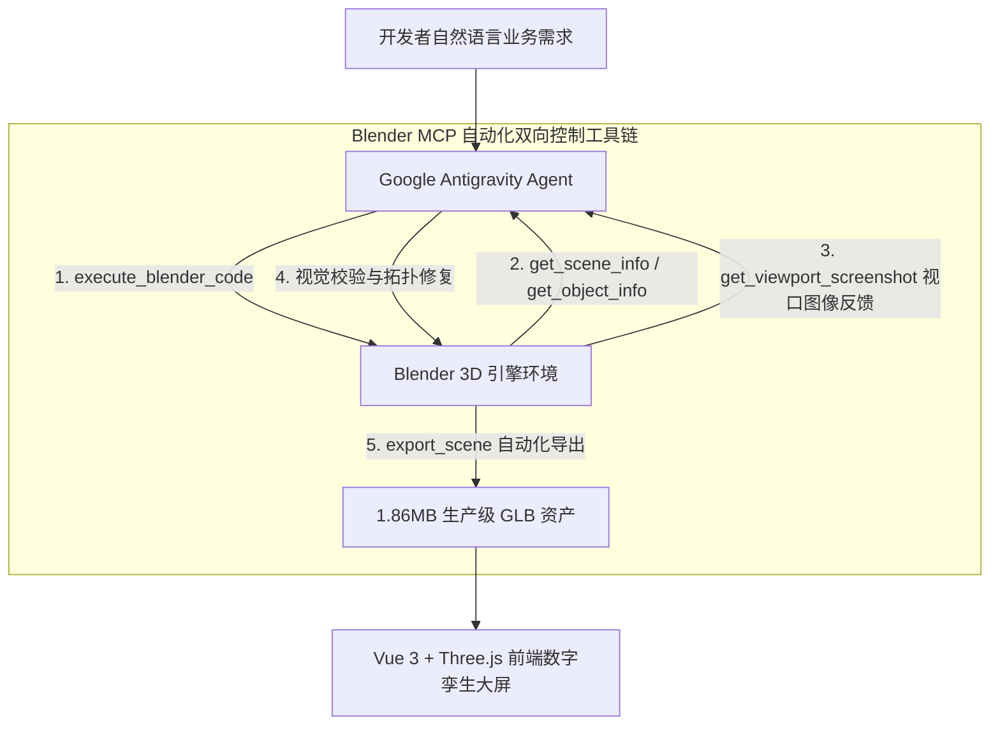

# Antigravity + Blender MCP：打造 3D 智慧仓储数字孪生

> **项目在线体验 (Live Demo)**：[https://smart-warehouse-wine.vercel.app](https://smart-warehouse-wine.vercel.app)  
> **开源代码仓库 (GitHub)**：[https://github.com/Xxcool/smart-warehouse](https://github.com/Xxcool/smart-warehouse)

---

## 一、前言：前端做 3D 数字孪生的核心痛点

随着智能制造、智慧物流与工业物联网（IoT）的快速演进，**3D 数字孪生（Digital Twin）管控大屏**已成为现代化工厂与仓储调度的核心基础设施。

然而长期以来，前端工程师在涉足 3D WebGL（Three.js / WebGPU）领域时，总会被两大核心难题掣肘：
1. **工业级 3D 资产获取极难**：网上能免费下载的模型要么是缺少工业规范的游戏低模，要么是层级混乱、动辄几百兆的工业 CAD 巨石文件，无法直接在浏览器端保持 60 FPS 流畅运行；
2. **建模与前端业务逻辑脱节**：传统流程中，3D 美术导出的模型往往构件原点全部堆在 `(0, 0, 0)`、前挡风玻璃发生剧烈深度冲突（Z-fighting）闪烁花屏、构件命名随意（全是 `Cube.087`）。前端想要挂载传感器拾取交互、实现 AGV 路径巡线，需要经历反复且漫长的返工沟通。

**“如果让 AI Agent 充当资深 3D 建模师，通过 MCP 协议直接操纵 Blender 生成符合业务逻辑的高精资产，再由前端完成工程化装配，会碰撞出怎样的火花？”**

在这篇文章中，我将手把手带大家复盘：**如何借助 Google Antigravity 原生集成的 Blender MCP（Model Context Protocol）工具链，无需手动写 Python 脚本，以全自动“代码生成 + 视口截屏校验 + 拓扑修复”的 Agentic 闭环生成整座工业园区，并结合 Vue 3 + Vite 5 + TypeScript + Three.js 打造出支持 60 FPS 动态巡航、智能避障、空间自适应弹窗投影的工业级数字孪生管控平台的全过程。**


---

## 二、告别手动建模：Antigravity 如何通过 Blender MCP 实现自动化建模？

传统 3D 建模流程中，开发者要么依赖美术手动建模，要么自己写 Python 脚本在 Blender 命令行或内置文本编辑器里手动调试运行，效率极低且无法形成自动化闭环。

在本项目中，我们采用了 **Antigravity + Blender MCP Server** 的自动化建模架构。



### 1. 什么是 Blender MCP？

**MCP（Model Context Protocol，模型上下文协议）** 允许 Antigravity 突破纯文本代码的限制，直接获得对宿主 3D 软件的“感知与控制能力”。挂载 Blender MCP 插件后，Antigravity 原生拥有了多项高维 3D 操纵工具：
* `execute_blender_code`：直接向 Blender 发送场景生成、几何布尔、材质赋予与灯光布置等空间操作；
* `get_viewport_screenshot`：**赋予 AI “视觉观察能力”**，实时捕获 Blender 视口截图，AI 自主检查模型比例、材质反光与摄像机视角；
* `get_scene_info` / `get_object_info`：毫秒级内省当前场景的构件层级树、顶点面数、边界盒与空间坐标；
* `export_scene`：完成优化后直接导出标准 GLTF/GLB 资产。

开发者**无需配置任何 Python 建模环境或手动执行脚本**，只需在 Antigravity 中描述场景需求，AI 即可在后台自主完成几何体生成与视觉闭环。

### 2. 参数化场景构建：从建筑到设备

借助 Blender MCP 工具链，Antigravity 自主对 Blender 发出指令，构建出满足现代物流调度的大型工业场景：

* **阶梯式剖切建筑墙体（1.2m ~ 5.5m）**：
  室内数字孪生最忌讳“封闭四壁遮挡视线”。Antigravity 在 Blender 中通过顶点切片算法，将靠近镜头视角的南墙、西墙截断降至 1.2m，北墙、东墙则保留 5.5m 钢构支撑梁，既勾勒出通透开阔的立体厂房轮廓，又彻底消除了视线死角。
* **3 大装卸月台（Loading Docks）与柔性密封罩**：
  1号泊位配备自动化伸缩滚筒流水线，2号、3号出入库泊位停靠大型冷链卡车，月台外侧配备橡胶防撞缓冲块与黄黑警示漆标线。
* **高位欧标立体货架区与恒温冷链气密仓**：
  立垛区采用欧标实木托盘搭建 3 层立体高位密集垛，并在北侧布局全封闭气密冷库（配备红外感应风幕门与专属冷链雪花防冻标识）。


### 3. Agent 视觉校验与拓扑修复：彻底根除 Z-Fighting 深度冲突

在模型导出后的渲染测试中，出现了一个典型的 3D 渲染缺陷：**卡车前挡风玻璃随着视角旋转产生剧烈的“黑白网格斑驳闪烁”（GPU 深度撕裂）**。

#### 原因剖析：
这是显卡渲染中极易发生的 **Z-fighting（深度缓冲区冲突）**。车头表面外壳与挡风玻璃处于**完全重合的几何平面**，GPU 在进行深度测试（Depth Test）时，由于浮点精度限制无法判定谁在前、谁在后，导致两个材质在同一像素上疯狂争抢，引发交替闪烁。

#### 修复策略（Antigravity 拓扑微凸外推）：
Antigravity 通过 MCP 工具捕获视口截图发现缺陷后，再次调用 `execute_blender_code` 定位挡风玻璃网格（`Truck_Windshield`），**沿着几何面法线方向向外微凸偏移 2.5cm（+0.025m）**，并在材质着色器中赋予微透明与菲涅尔高光，不仅物理级拉开深度差彻底消除了闪烁，还让玻璃获得了极其逼真的高光折射感。

```python
# Antigravity 通过 Blender MCP 执行拓扑修复示例
import bpy

obj = bpy.data.objects.get("Truck_Windshield")
if obj and obj.type == 'MESH':
    mesh = obj.data
    # 沿法线正方向微移 25mm，与车身物理隔离
    for vert in mesh.vertices:
        vert.co.z += 0.025
    mesh.update()
```


### 4. PBR 材质工作流与 1.86MB 极致轻量化

为了保证在移动端或普通笔记本浏览器中都能秒开并稳定保持 60 帧，Antigravity 在调用 `export_scene` 前执行了一系列自动化优化：
1. **剔除冗余细分面**：严格限制静态工业构件的面数，保留关键几何特征；
2. **构件语义化命名**：为所有动态节点打上规范 ID（如 `AGV_Robot_01`~`07`、`Truck_Moving_Road`、`WS_Workstation`），方便前端通过 `getObjectByName` 直接驱动；
3. **PBR 粗糙度/金属度材质合流**：导出为标准化单一二进制 `.glb`。

**最终整座包含 3 辆重卡、7 台 AGV、传送带滚筒、气密冷库及数百件货架货物的园区模型，总体积仅 1.86 MB！**

---

## 三、前端工程化重构：Vue 3 + Vite 5 + TypeScript + Three.js

在 Antigravity 自动化输出高质量轻量 3D 资产后，项目全面重构为**现代化前端工程架构**。

### 1. 架构分层与生命周期管理

* **3D 核心渲染器完全解耦**：将所有 Three.js 场景、相机、光照、射线拾取与循环动画封装在纯 TypeScript Class [`WarehouseScene.ts`](https://github.com/Xxcool/smart-warehouse/blob/main/src/core/WarehouseScene.ts) 中；
* **Vue 3 SFC 专注视图呈现**：在大屏组件挂载（`onMounted`）时绑定 Canvas 容器，在组件卸载（`onUnmounted`）时精准释放材质、几何体与 WebGL 上下文，彻底杜绝内存泄漏；
* **极速构建与强缓存支持**：借助 Vite 5 的 Manual Chunks 特性，将 `three` 与 `vue` 自动切分为独立长期缓存包。

### 2. 目录架构一览

```text
smart-warehouse/
├── public/
│   └── smart_warehouse.glb        # 1.86MB Blender 核心三维资产
├── src/
│   ├── components/
│   │   ├── HeaderBar.vue          # 大屏顶栏 (实时秒级时钟、气象温度、全屏)
│   │   ├── KpiRibbon.vue          # 核心运营 KPI (吞吐量、AGV运行率、库容)
│   │   ├── FloatingControls.vue   # 悬浮操作坞 (放大、缩小、复位、顶视、暂停)
│   │   ├── AnchoredPopup.vue      # 3D 空间动态吸附与防越界弹窗
│   │   └── LoadingOverlay.vue     # 109 项三维构件平滑加载指示器
│   ├── core/
│   │   ├── WarehouseScene.ts      # 3D 核心引擎 (渲染循环、巡线、射线拾取)
│   │   └── constants.ts           # 工业传感字典数据
│   ├── types/
│   │   └── warehouse.ts           # TypeScript 类型声明
│   ├── App.vue                    # 主界面装配
│   └── main.ts
```

---

## 四、数字孪生核心技术攻坚与算法落地

### 1. AGV 闭环正交巡线与 Catmull-Rom 路径避障

在现代智慧仓储中，AGV 搬运小车绝不是机械地折线瞬移，而是沿着地面铺设的磁轨/激光反光标记进行平滑加减速巡线作业。

#### 向心样条曲线平滑插值：
我们定义了 12 个正交拐点坐标，通过 `THREE.CatmullRomCurve3(points, true, 'centripetal', 0.05)` 构筑一条首尾相接、向心平滑的闭环轨迹。在主渲染帧（`requestAnimationFrame`）中：
1. 根据物理逝去时间计算各小车的归一化巡航进度 `t`（0.0 ~ 1.0）；
2. 调用 `curve.getPointAt(t)` 计算空间三维坐标；
3. 调用 `curve.getTangentAt(t)` 提取前向切线矢量，计算四元数让 AGV 车头**始终实时对齐运动切线方向**。

```typescript
// AGV 沿正交导引线平滑差速巡线算法
const t = (this.accumulatedTime * 0.035 + item.offset) % 1.0;
const pt = this.agvCurve.getPointAt(t);
const tangent = this.agvCurve.getTangentAt(t);

item.node.position.set(pt.x, 0.1, pt.z);
// 实时朝向与路径切线对齐
const dir = new THREE.Vector3(tangent.x, 0, tangent.z).normalize();
item.node.quaternion.setFromUnitVectors(new THREE.Vector3(1, 0, 0), dir);
```

#### 南区货架避障避碰实战：
在开发过程中，我们发现 AGV 行驶到南侧通道时会直接穿过暂存托盘货垛。通过获取实体精确的世界包围盒（BoundingBox），我们计算出：
* 中央分拣工作台最南端坐标为 `Z = 4.18`；
* 南区暂存立垛最北端坐标为 `Z = 5.91`；
* 两者之间实际存在一条宽度为 `1.73m` 的净空走廊通道。

我们将南侧航道的坐标点严格校准为 `Z = 4.95`，刚好位于正中间中线，与两侧货垛与工作台均保持了 **0.61m 的安全避让距离**，彻底解决了碾压货物的 BUG。


### 2. 多源异构设备协同动态孪生

一个真正鲜活的数字孪生系统，必须具备多设备并发运动仿真能力：

* **外部干线公路重卡巡航（Highway Heavy Truck Cruise）**：
  在园区外侧直行干道（`X = 28.5m`）部署动态干线物流车，设定 50m 闭环线性行驶区间，车速与车轮自转角速度严格联动，且与出库月台停靠车辆保持近 3 米安全工业车距，杜绝车头相撞；
* **1号月台伸缩滚筒自动化物料流（Conveyor Belt Stream）**：
  在滚筒线上生成 6 组错峰偏移的货箱队列，匀速从卡车尾门驳运至分拣操作台，形成川流不息的自动化出入库流；
* **7 台 AGV 集群差速作业**：
  每台小车设置相差 `1/7` 的初始相位偏置，在环形主干道上形成错落有致的作业集群，模拟多机协同作业调度。

### 3. 空间射线拾取与自适应 3D 锚定弹窗

点击 3D 场景中的任意电脑、托盘堆、冷库气密门、AGV 或卡车，需要弹出对应设备的实时传感器与运行态数据卡片。

#### 核心投影与防越界算法：
1. **Raycaster 碰撞拾取**：获取点击点在三维世界中的精确坐标 `hit.point`；
2. **三维转二维（Vector3.project）**：将世界坐标向量经由相机投影矩阵转换至裁剪空间，再映射为屏幕实际像素坐标 `(rawX, rawY)`；
3. **优先正上方（Placement-Top）与智能下翻**：
   - 默认将卡片锚定在点击目标的正上方，符合操作者视线自然向下聚焦物体的工业人机工效；
   - 当物体过于贴近屏幕顶栏时（上方可用空间小于 45px），卡片自动智能翻转至物体下方；
4. **视口弹性吸附（Viewport Clamping）**：
   卡片宽度严格固定 320px，通过数学边界限制，确保在任何屏幕尺寸下卡片 100% 完整呈现在视口内、绝对不超出屏幕可视区域！

```typescript
// 屏幕投影与视口防越界算法
tempProjVec.project(camera);

// 映射屏幕物理像素
const rawX = (tempProjVec.x * 0.5 + 0.5) * window.innerWidth;
const rawY = (-(tempProjVec.y * 0.5) + 0.5) * window.innerHeight;

// 优先顶部放置，空间不足自动翻转至下方
const isBottom = rawY < safeTop + 45;

// 水平边界弹性吸附，绝不溢出屏幕
const halfW = 160;
const clampedX = Math.max(safeLeft + halfW, Math.min(safeRight - halfW, rawX));

// 动态小三角指示箭头偏移补偿 (精准指向三维实际点击点)
const caretOffset = rawX - clampedX;
```

### 4. 纯 WebGL 相机 Dolly 缩放，杜绝破坏 HUD 精度

普通网页缩放（Pinch-to-zoom 或 Ctrl+滚轮）会把网页文字、顶栏、弹窗卡片一同缩放，导致大屏 UI 模糊变形、布局破碎。

我们全局拦截了浏览器的原生手势与滚轮事件，将每一次缩放操作转化为 **三维摄像机沿视准轴向的前后 Dolly 位移**：
* 顶栏 Header、KPI 胶囊、操作坞与弹窗等 DOM 元素始终维持精准物理像素；
* 只有三维世界中的仓库模型拉近拉远，操作手感丝滑媲美专业桌面 CAD 软件。

---

## 五、全球 CDN 极速部署：Vercel 生产强缓存调优

在完成代码构建后，我们通过 GitHub 与 Vercel 实现了自动化持续集成与部署。

为了让近 2MB 的 `.glb` 3D 模型资产在全球范围内秒级加载，我们在 `vercel.json` 中配置了特定的 MIME 类型与跨域强缓存：

```json
{
  "$schema": "https://openapi.vercel.sh/vercel.json",
  "framework": "vite",
  "buildCommand": "npm run build",
  "outputDirectory": "dist",
  "cleanUrls": true,
  "headers": [
    {
      "source": "/(.*).glb",
      "headers": [
        { "key": "Content-Type", "value": "model/gltf-binary" },
        { "key": "Cache-Control", "value": "public, max-age=31536000, immutable" },
        { "key": "Access-Control-Allow-Origin", "value": "*" }
      ]
    }
  ]
}
```

* **MIME 规范化**：显式声明 `model/gltf-binary`，防止部分浏览器因解析为通用字节流而阻塞流式几何解析；
* **Immutable 强缓存**：设置 `max-age=31536000, immutable`，用户后续访问直接从浏览器本地磁盘缓存秒开，无需二次网络请求！

---

## 六、结语与全栈思考

回顾整个项目的推进过程：

```text
工业自然语言构想 
  ➔ Google Antigravity + Blender MCP 自动化闭环建模 (无需手动写脚本)
  ➔ 拓扑级优化修复 (根除 Z-fighting、轻量化 PBR 烘焙至 1.86MB)
  ➔ Vue 3 + Vite 5 + TypeScript + Three.js 现代化前端工程化封装
  ➔ Catmull-Rom 导引样条路径规划 + 空间射线拾取 + 动态防越界投影
  ➔ Vercel 全球边缘 CDN 毫秒级交付
```

在 AI Agent 浪潮下，**“前端 3D 开发”的技术边界正在被彻底重构**。通过 Antigravity 搭载 Blender MCP，开发者不再需要手动去配置和编写复杂的 Python 建模脚本，更无需漫长等待外部 3D 团队支援，而是能以一人之力贯通 3D 资产生成、工业级渲染调优、状态解耦与全球交付的全流程。

希望这篇硬核实战复盘能为大家探索 Web 3D 与数字孪生产生启发！欢迎在评论区交流讨论，也欢迎给开源项目点个 Star 支持一下：

- 🎮 **线上可玩 Demo**：[smart-warehouse-wine.vercel.app](https://smart-warehouse-wine.vercel.app)
- 💻 **GitHub 源码**：[github.com/Xxcool/smart-warehouse](https://github.com/Xxcool/smart-warehouse)
